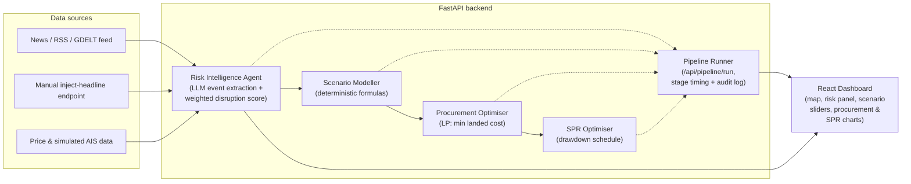

# EnergyShield AI

**Turning India's energy-import risk management from reactive to anticipatory — an AI system that watches disruption signals, models their impact, and recommends what to do about it, end to end.**

Built for IEEE SYNAPSE 2026, ET AI Hackathon Problem Statement #2: *AI-Driven Energy Supply Chain Resilience for Import-Dependent Economies*.

---

## 1. The problem

India imports roughly **88% of its crude oil**, and **40–45% of that flows through the Strait of Hormuz**. Our Strategic Petroleum Reserve (SPR) covers only about **9.5 days** of consumption. A single chokepoint incident — a tanker seizure, a strait closure threat, a shipping-lane attack — can put the country within days of a fuel supply gap, and today's planning tools are static spreadsheets that get updated *after* the news breaks, not before.

The gap we are targeting: there is no system that continuously watches geopolitical and logistics risk signals, models what a disruption would actually do to supply and price, and turns that into a concrete, executable procurement and reserve-drawdown plan — fast enough to matter.

## 2. The solution

EnergyShield AI is a pipeline, not a single model. It chains together six purpose-built modules so that a raw signal (a headline, a price move, an anomalous vessel pattern) turns into a ranked, numeric, explainable recommendation:

1. **Risk Intelligence Agent** reads news/feeds, extracts structured events with an LLM, and scores disruption risk (0–100) per shipping corridor from a transparent, weighted formula — never from LLM vibes.
2. **Scenario Modeller** takes a risk scenario (e.g. "Hormuz 50% closure, 30 days") and computes supply gap, refinery run-rate impact, price impact, and SPR days-of-cover using deterministic formulas with documented assumptions — not a black box.
3. **Procurement Optimiser** runs a linear program over real supplier/route/capacity constraints to find the minimum-landed-cost sourcing plan that closes the gap.
4. **SPR Optimiser** computes a drawdown schedule to bridge the gap until alternate cargoes arrive.
5. **Pipeline runner** chains all of the above into one call and times every stage, so we can demonstrate signal-to-recommendation latency directly — one of the problem statement's own evaluation criteria.
6. **React dashboard** visualises all of it on a live map and charts, and lets a judge inject a headline and watch the whole chain react.

LLM calls are confined to text understanding (event extraction, memo drafting) and are cached; **every number shown is produced by a deterministic model**, so the system stays auditable and explainable to judges, not just impressive-looking.

## 3. The six modules

| # | Module | What it does | Owner |
|---|--------|--------------|-------|
| 1 | Risk Intelligence Agent | Ingests headlines (RSS/GDELT + manual "inject headline" endpoint), extracts events via LLM, computes a 0–100 disruption score per corridor (Hormuz, Bab-el-Mandeb/Red Sea, Suez, Malacca, Cape route) from weighted news severity + price volatility + simulated vessel anomaly, with full evidence trail | rehanmujawar087 |
| 2 | Digital Twin Map | Corridors coloured by live risk, Indian ports, refineries, SPR sites (Visakhapatnam, Mangaluru, Padur), simulated AIS vessels on real waypoints | khadija1407 |
| 3 | Scenario Modeller | Deterministic presets (Hormuz partial closure, Red Sea suspension, OPEC+ cut) + sliders (closure %, duration, demand elasticity) → supply gap, refinery impact, price impact, SPR days of cover, rough GDP impact; assumptions documented and editable | sagar3468patil-hash |
| 4 | Procurement Optimiser | LP minimising landed cost under the active scenario, subject to supplier capacity, route availability, transit time, port capacity, and refinery grade compatibility; ranked alternatives + LLM memo quoting only optimiser numbers | sagar3468patil-hash |
| 5 | SPR Optimiser | Drawdown schedule to bridge the supply gap until alternate cargoes arrive, with a days-of-cover chart | sagar3468patil-hash |
| 6 | Pipeline Runner | `POST /api/pipeline/run` chains signal → score → scenario → procurement → SPR in one call, returns per-stage timing and an audit log | rehanmujawar087 |

Frontend panels for modules 3–5 and the overall dashboard/demo script are owned by PradnyaN21.

## 4. Tech stack

**Backend:** Python 3.11+, FastAPI, Pydantic, pandas, SciPy/PuLP (linear programming), NetworkX, Uvicorn.

**LLM:** Groq (Llama 3.3 70B) behind a single `llm.py` interface, with Gemini supported via an environment-variable swap. Structured JSON outputs only, all responses cached under `.cache/`, and a deterministic rule-based fallback if the API is offline or unavailable. The LLM extracts events and drafts memos — it never produces the numbers that drive the dashboard.

**Frontend:** React + Vite + Tailwind CSS, react-leaflet (map/digital twin), Recharts (charts), dark control-room styled UI.

**Data:** No database. JSON/CSV seed data under `/data` (suppliers, corridors, ports, refineries, SPR sites, assumptions). All simulated figures (e.g. vessel tracks) are explicitly labelled **SIMULATED** in both the UI and the docs, and approximate seed numbers are documented with sources/notes in `data/README.md`.

## 5. Architecture



## 6. Planned demo flow

1. Open the dashboard: map shows live corridor risk colouring (Hormuz, Red Sea, Suez, Malacca, Cape route), Indian ports/refineries/SPR sites, and simulated vessels.
2. Judge (or presenter) **injects a headline** via the UI (e.g. "tanker seized near Strait of Hormuz") — the Hormuz risk score jumps and an evidence card appears showing the extracted event and source.
3. Presenter selects the **"Hormuz 50% closure, 30 days"** scenario preset — supply gap, refinery run-rate drop, fuel price impact, and SPR days-of-cover update live, with the underlying assumptions visible and editable.
4. Dashboard shows **ranked procurement alternatives** with landed cost and arrival time for each.
5. **SPR drawdown chart** shows the reserve bridging the gap until the first alternate cargo arrives.
6. An on-screen timer shows **signal → recommendation in N seconds**, end to end.
7. Presenter opens the **assumptions panel** to show every number in the model is sourced and editable, not hard-coded magic.

## 7. Status

**PLANNED** (all six modules described above — Risk Intelligence Agent, Digital Twin map, Scenario Modeller, Procurement Optimiser, SPR Optimiser, Pipeline runner — none of this module logic is implemented yet):

- Real Risk Intelligence Agent (LLM event extraction, live disruption scoring, evidence trail).
- Digital Twin map (corridor risk colouring, ports/refineries/SPR sites, simulated vessels).
- Scenario Modeller, Procurement Optimiser, SPR Optimiser deterministic implementations.
- Pipeline runner chaining the modules together with stage timing.
- API contract docs (`docs/API.md`), mock endpoints, and seed data under `/data`.
- Full React dashboard built on the modules above.

**BUILT** (only what is actually in this repo right now):

- `README.md` (this file), `.gitignore`, `.env.example`.
- `CLAUDE.md` with hackathon rules, stack, commit convention, and the ownership table.
- `backend/`: FastAPI app exposing `GET /api/health`, `requirements.txt` — verified running locally and returning `200 OK`.
- `frontend/`: Vite + React app shell that renders the project name, `package.json` — verified `npm run dev` starts and serves the page.

Nothing above is claimed as working unless it is listed under BUILT. This section is updated honestly as the build progresses — it is not a claim of what we intend to build, only what currently runs.

## 8. Team

| GitHub | Role |
|--------|------|
| [rehanmujawar087](https://github.com/rehanmujawar087) | Team lead — backend core, Risk Intelligence Agent, pipeline runner, `llm.py` |
| [sagar3468patil-hash](https://github.com/sagar3468patil-hash) | Scenario Modeller, Procurement Optimiser, SPR Optimiser |
| [khadija1407](https://github.com/khadija1407) | Frontend — digital twin map, corridor risk dashboard |
| [PradnyaN21](https://github.com/PradnyaN21) | Frontend — scenario/procurement/SPR panels, README, demo script, deck |

## 9. Setup

What runs today (verified locally):

```bash
# Backend — health check only
cd backend
python -m venv .venv
.venv\Scripts\activate        # Windows; use `source .venv/bin/activate` on macOS/Linux
pip install -r requirements.txt
uvicorn app.main:app --reload --port 8000
# curl http://127.0.0.1:8000/api/health -> {"status":"ok", ...}

# Frontend — app shell only
cd frontend
npm install
npm run dev
# open http://localhost:5173 -> renders "EnergyShield AI"
```

Module endpoints, the dashboard UI, and the API contract (`docs/API.md`) will be added in later commits — see the Status section above for exactly what exists right now.

---

*Where this project uses simulated or approximate data (e.g. vessel tracks, seed figures), it will be clearly labelled as such in the UI and docs once that data is added.*
