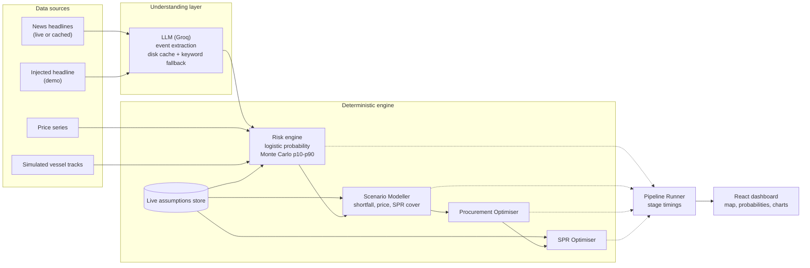

<div align="center">

# 🛡️ EnergyShield AI

### From reactive crisis response to anticipatory energy-supply resilience

*An AI pipeline that watches disruption signals, models their impact, and tells procurement teams what to do about it.*


</div>

---

## 📑 Contents
[The Problem](#-the-problem) · [Our Solution](#-our-solution) · [Key Features](#-key-features) · [Modules](#-the-six-modules) · [Probability Model](#-how-the-disruption-probability-works) · [Architecture](#-architecture) · [Tech Stack](#-tech-stack) · [Demo Flow](#-demo-flow) · [Screenshots](#-screenshots) · [Status](#-project-status) · [Setup](#-setup) · [API](#-api) · [Repo Layout](#-repository-layout) · [Evaluation Focus](#-alignment-with-the-evaluation-focus) · [Future Scope](#-future-scope) · [Team](#-team) · [Data & Honesty Notes](#-data--honesty-notes)

---

## 🚨 The Problem

> **India imports ~88% of its crude oil. 40–45% of that passes through the Strait of Hormuz. Our Strategic Petroleum Reserve covers only ~9.5 days.**

A single chokepoint incident (a tanker seizure, a closure threat, a shipping-lane attack) can leave the country days away from a fuel supply gap. Today's planning tools are static: they are updated *after* the news breaks, they cannot model a geopolitical shock in real time, and they cannot turn a risk signal into a concrete procurement and reserve plan fast enough to matter.

**The gap:** no system continuously watches risk signals, models what a disruption would do to supply and price, and produces an *executable* sourcing plan within hours.

*(Figures as stated in the ET AI Hackathon problem statement #2.)*

---

## 💡 Our Solution

EnergyShield AI is a **pipeline, not a single model**. A raw signal (a headline, a price move, an anomalous vessel pattern) becomes a ranked, numeric, explainable recommendation:

```
Signal  →  Disruption probability  →  Scenario impact  →  Procurement plan  →  Reserve plan
```

**Design principle:** the LLM only *understands text* (event extraction, memo drafting). **Every number comes from a deterministic model** with explicit, editable assumptions, so the system is auditable and explainable.

---

## ✨ Key Features

- 🔍 **Headline-to-event extraction:** an LLM (Groq) turns raw headlines into structured events, with a disk cache and a keyword fallback so the demo never depends on the network.
- 🎲 **Probabilities with uncertainty:** a per-corridor disruption probability with a p10 / p50 / p90 band and the top drivers behind each score.
- 📉 **Scenario modelling:** Hormuz partial closure, Red Sea suspension and OPEC+ cut presets, with sliders for closure %, duration and demand elasticity.
- 🛢️ **Procurement optimisation:** alternative suppliers and routes ranked by landed cost under capacity and transit constraints.
- 🏛️ **Reserve planning:** an SPR drawdown plan and days of cover under the modelled shortfall.
- 🗺️ **Digital twin map:** corridors coloured by risk, ports, refineries and reserve sites, with simulated vessels on real waypoints.
- ⚙️ **Editable assumptions:** one live store feeds the risk, scenario and reserve models, each with a source note.
- 🏷️ **Honesty labels:** every panel is marked LIVE, CACHED, MOCK or SIMULATED, and the extraction source is shown.
- ⏱️ **Pipeline timing:** stage-by-stage timing for the signal-to-recommendation path.

---

## 🧩 The Six Modules

| # | Module | What it does | Owner |
|---|--------|--------------|-------|
| 1 | 🔍 **Risk Intelligence Agent** | Takes headlines (including a manual *inject headline* input), extracts structured events with an LLM (Groq, with disk cache and a keyword fallback), and computes a disruption **probability per corridor** with an uncertainty band and driver breakdown | `rehanmujawar087` |
| 2 | 🗺️ **Digital Twin Map** | Corridors coloured by risk; ports, refineries and SPR sites; simulated vessels on real waypoints | `khadija1407` |
| 3 | 📉 **Scenario Modeller** | Presets (Hormuz partial closure, Red Sea suspension, OPEC+ cut) with sliders for closure %, duration and demand elasticity; reads from the live assumptions store | `sagar3468patil-hash` |
| 4 | 🛢️ **Procurement Optimiser** | Optimiser ranks alternative suppliers and routes by landed cost under capacity and transit constraints | `sagar3468patil-hash` |
| 5 | 🏛️ **SPR Optimiser** | Drawdown plan and days of reserve cover, wired to the same live assumptions | `sagar3468patil-hash` |
| 6 | ⏱️ **Pipeline Runner** | Chains the stages and reports per-stage timing | `rehanmujawar087` |

The **React dashboard** (`khadija1407`, `PradnyaN21`) brings it together: map, probability cards with p10 / p50 / p90, shortfall view, procurement options, reserves and data-source labels.

---

## 🎲 How the Disruption Probability Works

1. **Features:** news severity (from extracted events), price volatility, vessel anomaly (simulated) and a corridor base rate.
2. **Logistic model:** `p = sigmoid(b0 + sum of w_i · x_i)`, with weights stored in the editable assumptions store.
3. **Monte Carlo:** repeated draws jitter inputs and weights to give a **p10 / p50 / p90** band per corridor.
4. **Explainability:** the top drivers are shown for each corridor, so every score can be challenged.

> ⚠️ **Honest limit:** weights are hand-set priors, **not trained or calibrated**. The probabilities are a transparent heuristic, not a measured forecast accuracy.

---

## 🏗️ Architecture



---

## 🧰 Tech Stack

| Layer | Technology | Why |
|-------|------------|-----|
| Backend API | **FastAPI**, pydantic, uvicorn | Typed contracts, fast to build |
| Optimisation and maths | **SciPy / NumPy** | Explainable sourcing plans, Monte Carlo |
| LLM | **Groq** (Llama 3.3 70B) | Extraction and memo drafting only; responses cached on disk |
| Frontend | **React + Vite + Tailwind** | Control-room dashboard |
| Maps and charts | **react-leaflet**, Recharts | Geospatial view and charts |
| Data | JSON / CSV seed files | No database needed for the prototype |

---

## 🎬 Demo Flow

1. **Baseline view:** the map and the corridor probability cards (p10 / p50 / p90) load.
2. **Inject a headline** (for example, a tanker incident near Hormuz): the extraction source is shown (LLM or keyword fallback), and the Hormuz probability moves.
3. **Run a scenario**, for example *Hormuz 50% closure*: shortfall, price impact and SPR days of cover update.
4. **Procurement options** are ranked by landed cost.
5. **Reserve plan** shows how the SPR bridges the gap.
6. **Honesty labels** show which data is live, cached, mock or simulated.

---

## 📸 Screenshots

> Save your screenshots in `docs/images/` with these names.

| Dashboard | Probabilities and shortfall |
|-----------|-----------------------------|
|  |  |

---

## 📊 Project Status

| Item | State |
|------|-------|
| Repo, README, architecture, `CLAUDE.md` | ✅ Done |
| Backend skeleton and `GET /api/health` | ✅ Done |
| Frontend app shell and dashboard | ✅ Done |
| LLM event extraction (Groq) with disk cache and keyword fallback | ✅ Done |
| Corridor probability model (logistic + Monte Carlo p10/p50/p90) | ✅ Done |
| Procurement optimiser | ✅ Done |
| Scenario Modeller wired to live assumptions store | ✅ Done |
| SPR Optimiser wired to live assumptions store | ✅ Done |
| Frontend: probability bands, shortfall, extraction-source labels | ✅ Done |
| Live headline feeds (RSS / GDELT) with cached fallback | ✅ Prototype |
| Digital Twin map (simulated vessels) | ✅ Prototype |
| Pipeline Runner with per-stage timing | ✅ Prototype |

*Prototype = working end to end on seed or cached data, as labelled on screen.*

---

## 🚀 Setup

**Prerequisites:** Python 3.11+, Node 18+, Git.

**1. Environment:** copy `.env.example` to `.env` and add your LLM key (see the file for the variable name). Never commit `.env`. Without a key, the app falls back to keyword extraction.

**2. Backend**
```bash
cd backend
python -m venv .venv
# Windows:  .venv\Scripts\activate
# macOS/Linux:  source .venv/bin/activate
pip install -r requirements.txt
uvicorn app.main:app --reload --port 8000
# check: http://127.0.0.1:8000/api/health
```

**3. Frontend**
```bash
cd frontend
npm install
npm run dev
# open: http://localhost:5173
```

---

## 🔌 API

The full contract, with request and response examples, is in [`docs/API.md`](docs/API.md). With the backend running, interactive docs are available at `http://127.0.0.1:8000/docs`.

---

## 📁 Repository Layout

```
energyshield-ai/
├── backend/            FastAPI app (agents, models, routers, llm layer)
├── frontend/           React + Vite dashboard
├── data/               Seed datasets and assumptions (documented, approximate)
├── docs/               API contract and screenshots
├── CLAUDE.md           Team rules and module ownership
└── README.md
```

---

## 🎯 Alignment with the Evaluation Focus

| Problem statement focus | How EnergyShield AI addresses it |
|-------------------------|----------------------------------|
| Disruption signal detection lead time and accuracy | Headlines become structured events and move corridor probabilities immediately, with explainable drivers |
| Quality and executability of procurement alternatives | Optimiser ranks suppliers and routes by landed cost under capacity and transit constraints |
| Scenario model fidelity, with explicit and testable assumptions | One editable assumptions store with a source note per item |
| Geospatial evidence depth | Digital twin map of corridors, ports, refineries and reserve sites |
| End-to-end time from signal to recommendation | Per-stage pipeline timing |

---

## 🔭 Future Scope

- Calibrate the probability model against historical disruption events
- Integrate live AIS, sanctions-registry and commodity-price feeds
- Knowledge graph of supplier, route, port and refinery relationships
- RAG "ask the analyst" over policy and market documents
- Extend the same engine to LNG and other import dependencies

---

## 👥 Team

| Member | Focus |
|--------|-------|
| [Rehan Mujawar](https://github.com/rehanmujawar087) | Backend core, Risk Intelligence Agent, pipeline runner, LLM layer |
| [Sagar Patil](https://github.com/sagar3468patil-hash) | Scenario Modeller, Procurement Optimiser, SPR Optimiser |
| [Khadija Jamadar](https://github.com/khadija1407) | Digital Twin map, corridor risk dashboard |
| [Pradnya Patil](https://github.com/PradnyaN21) | Dashboard panels, README, demo script, deck |

---

## ⚖️ Data & Honesty Notes

- **Vessel positions are simulated** and labelled so in the UI. We do not claim a live AIS feed.
- **Seed data is approximate** and documented in `data/README.md`. It demonstrates the method; it does not replace official statistics.
- **LLM output never produces numbers.** It extracts events and drafts text; probabilities, impacts and sourcing plans come from deterministic, inspectable models.
- **Probabilities are an uncalibrated prior**, not a measured forecast accuracy.
- Assumptions live in one editable store with a source note for each, so the model can be tested and challenged.
- Every panel is labelled LIVE, CACHED, MOCK or SIMULATED.
- AI coding assistants were used during development, as the hackathon permits. The team is responsible for understanding and explaining all code.

<div align="center">

*Built in a single hackathon day at IEEE SYNAPSE 2026.*

</div>
