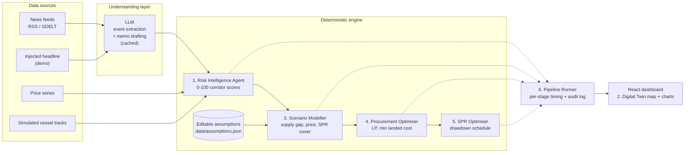

 <div align="center">

# 🛡️ EnergyShield AI

### From reactive crisis response to anticipatory energy-supply resilience

*An AI pipeline that watches disruption signals, models their impact, and tells procurement teams what to do about it.*


</div>

---

## 📑 Contents
[The Problem](#-the-problem) · [Our Solution](#-our-solution) · [Modules](#-the-six-modules) · [Architecture](#-architecture) · [Tech Stack](#-tech-stack) · [Demo Flow](#-demo-flow) · [Status](#-project-status) · [Setup](#-setup) · [Repo Layout](#-repository-layout) · [Team](#-team) · [Data & Honesty Notes](#-data--honesty-notes)

---

## 🚨 The Problem

> **India imports ~88% of its crude oil. 40–45% of that passes through the Strait of Hormuz. Our Strategic Petroleum Reserve covers only ~9.5 days.**

A single chokepoint incident (a tanker seizure, a closure threat, a shipping-lane attack) can leave the country days away from a fuel supply gap. Today's planning tools are static: they are updated *after* the news breaks, they cannot model a geopolitical shock in real time, and they cannot turn a risk signal into a concrete procurement and reserve plan fast enough to matter.

**The gap:** no system continuously watches risk signals, models what a disruption would do to supply and price, and produces an *executable* sourcing plan within hours.

---

## 💡 Our Solution

EnergyShield AI is a **pipeline, not a single model**. A raw signal (a headline, a price move, an anomalous vessel pattern) becomes a ranked, numeric, explainable recommendation:

```
Signal  →  Risk score  →  Scenario impact  →  Procurement plan  →  Reserve plan
```

**Design principle:** the LLM only *understands text* (event extraction, memo drafting). **Every number you see comes from a deterministic model** with explicit, editable assumptions, so the system is auditable and explainable, not just impressive-looking.

---

## 🧩 The Six Modules

| # | Module | What it does | Owner |
|---|--------|--------------|-------|
| 1 | 🔍 **Risk Intelligence Agent** | Ingests headlines (RSS/GDELT plus a manual *inject headline* endpoint), extracts structured events with an LLM, and scores disruption risk (0–100) per corridor from weighted news severity + price volatility + simulated vessel anomaly, with a full evidence trail | `rehanmujawar087` |
| 2 | 🗺️ **Digital Twin Map** | Corridors coloured by live risk; Indian ports, refineries and SPR sites (Visakhapatnam, Mangaluru, Padur); simulated vessels on real waypoints | `khadija1407` |
| 3 | 📉 **Scenario Modeller** | Presets (Hormuz partial closure, Red Sea suspension, OPEC+ cut) with sliders for closure %, duration and demand elasticity. Outputs supply gap, refinery run-rate drop, price impact, SPR days of cover and a rough GDP effect | `sagar3468patil-hash` |
| 4 | 🛢️ **Procurement Optimiser** | A linear program over supplier capacity, routes, transit time, port capacity and refinery grade compatibility. Returns ranked, minimum-landed-cost sourcing options plus a memo | `sagar3468patil-hash` |
| 5 | 🏛️ **SPR Optimiser** | Drawdown schedule that bridges the supply gap until alternate cargoes arrive, with a days-of-cover chart | `sagar3468patil-hash` |
| 6 | ⏱️ **Pipeline Runner** | One call chains modules 1→5 and **times every stage**, to demonstrate signal-to-recommendation latency | `rehanmujawar087` |

The **React dashboard** (`khadija1407`, `PradnyaN21`) brings it together: live map, scenario sliders, ranked options, reserve chart, and an *inject headline* button so a judge can watch the whole chain react.

---

## 🏗️ Architecture



---

## 🧰 Tech Stack

| Layer | Technology | Why |
|-------|------------|-----|
| Backend API | **FastAPI**, pydantic, uvicorn | Typed contracts, fast to build |
| Optimisation | **SciPy / PuLP** (linear programming) | Provable, explainable sourcing plans |
| Analysis | pandas, networkx | Scenario maths and route/supplier graph |
| LLM | **Groq** (Llama 3.3 70B), Gemini optional | Extraction and memo drafting only; responses cached |
| Frontend | **React + Vite + Tailwind** | Control-room dashboard |
| Maps & charts | **react-leaflet**, Recharts | Geospatial evidence and reserve charts |
| Data | JSON / CSV seed files | No database needed for the prototype |

---

## 🎬 Demo Flow

1. **Baseline view:** the map shows corridor risk, ports, refineries and SPR sites.
2. **Inject a headline** (for example, a Gulf tanker incident): the Hormuz score jumps and an evidence card shows the source.
3. **Run a scenario**, e.g. *Hormuz 50% closure, 30 days*: supply gap, refinery impact and SPR days of cover update.
4. **Ranked procurement alternatives** appear with cost and arrival time.
5. **SPR drawdown plan** shows how reserves bridge the gap.
6. **Pipeline timer** reports *"signal → recommendation in N seconds"*.
7. **Assumptions panel:** every assumption is visible and editable, so the model's logic can be tested.

---

## 📊 Project Status

> We are building **step by step** during the hackathon window. This section is updated honestly as work lands.

| Item | State |
|------|-------|
| Repo, README, architecture, `CLAUDE.md` | ✅ Done |
| Backend skeleton + `GET /api/health` | ✅ Built and verified |
| Frontend app shell (Vite + React) | ✅ Built and verified |
| API contract + mock endpoints | 🔄 Next |
| Risk Intelligence Agent | ⏳ Planned |
| Digital Twin Map | ⏳ Planned |
| Scenario Modeller | ⏳ Planned |
| Procurement Optimiser | ⏳ Planned |
| SPR Optimiser | ⏳ Planned |
| Pipeline Runner + timing | ⏳ Planned |
| Stretch: knowledge graph, RAG "Ask the analyst", backtest | 💤 If time allows |

---

## 🚀 Setup

**Prerequisites:** Python 3.11+, Node 18+, Git.

**Backend**
```bash
cd backend
python -m venv .venv
# Windows:  .venv\Scripts\activate
# macOS/Linux:  source .venv/bin/activate
pip install -r requirements.txt
uvicorn app.main:app --reload --port 8000
# check: http://127.0.0.1:8000/api/health
```

**Frontend**
```bash
cd frontend
npm install
npm run dev
# open: http://localhost:5173
```

**Environment:** copy `.env.example` to `.env` and add your LLM key. Never commit `.env`.

---

## 📁 Repository Layout

```
energyshield-ai/
├── backend/            FastAPI app (agents, models, routers, llm layer)
├── frontend/           React + Vite dashboard
├── data/               Seed datasets + assumptions (documented, approximate)
├── docs/               API contract
├── CLAUDE.md           Team rules and module ownership
└── README.md
```

---

## 👥 Team

| Member | Focus |
|--------|-------|
| [`rehanmujawar087`](https://github.com/rehanmujawar087) | Backend core, Risk Intelligence Agent, pipeline runner, LLM layer |
| [`sagar3468patil-hash`](https://github.com/sagar3468patil-hash) | Scenario Modeller, Procurement Optimiser, SPR Optimiser |
| [`khadija1407`](https://github.com/khadija1407) | Digital Twin map, corridor risk dashboard |
| [`PradnyaN21`](https://github.com/PradnyaN21) | Dashboard panels, README, demo script, deck |

---

## ⚖️ Data & Honesty Notes

- **Vessel positions are simulated** and labelled so in the UI. We do not claim a live AIS feed.
- **Seed data is approximate** and documented in `data/README.md`. It is meant to demonstrate the method, not to replace official statistics.
- **LLM output never produces numbers.** It extracts events and drafts memos; scores, impacts and sourcing plans come from deterministic, inspectable models.
- Assumptions live in one editable file with a source note for each, so the model can be tested and challenged.
- AI coding assistants were used during development, as the hackathon permits. The team is responsible for understanding and explaining all code.

<div align="center">

*Built in a single hackathon day at IEEE SYNAPSE 2026.*

</div>
